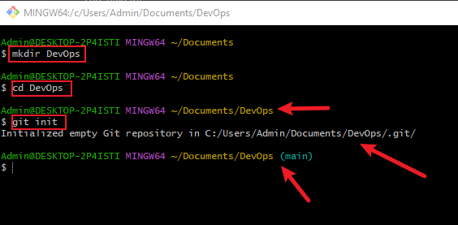
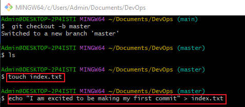
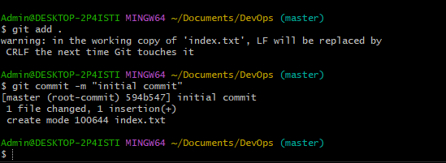
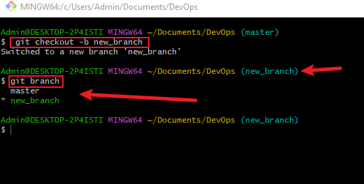
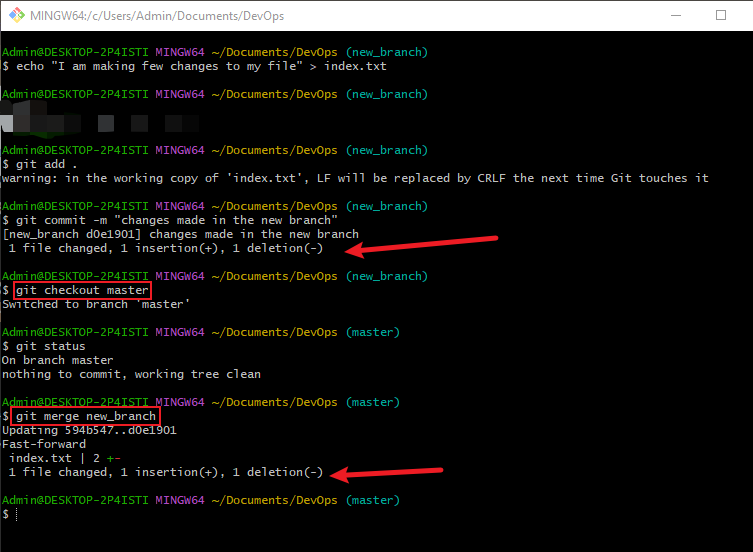
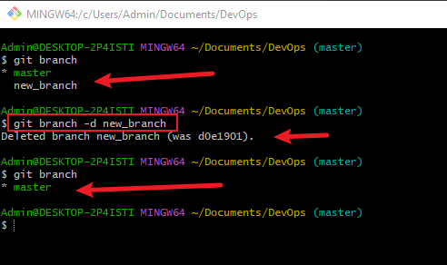

## GIT PROJECT

<b>Git</b> is a distributed version control system that tracks changes in any set of computer files, usually used for coordinating work among programmers who are collaboratively developing source code during software development. Its goals include speed, data integrity, and support for distributed, non-linear workflows.

This Git Project is to help beginners to understand the basic concepts. 
In this project, I will be showing how to efficiently initialize a Repository, make Commits, work with Branches and many more.

*Lets dive in!*

## Initializing a Repository
To begin with, click [Git](https://git-scm.com/download/) to download and install on your system. 
*It is easy to install, you just need to follow the instruction*

After you are done installing, follow the below steps:
- Type Git or Bash in the search bar to open the Git Bash Terminal
- Creat a working Directory or Folder using mkdir dir_name eg `mkdir DevOps`
- Now change or move into your working directory or folder using this command cd dir_name eg `cd DevOps`
- Now that you are inside the working directory or folder run `git init` command to initialize it as a Git repository (repo).

See figure below:

## Making First Commit
The git commit command is used to move files from the staging area to your local repository.  After executing the git commit, your staging area will be empty.

Let us make our first Commit by following the below steps:
- Inside the working directory *DevOps* type this command `touch index.txt` to create a text file called index.txt
- Use the command `echo "your_text" > index.txt to write inside your text file
- Use the command `git add` to add your changes to git staging area
- Run `git commit -m "initial commit"` to Commit the changes to git

See figure below:

## Working with Branch
To make our first git branch, follow the steps below:
- Run this command `git checkout -b [branch_name]` eg `git checkout -b new_branch`
- Now list your git branches with this command `git branch`

## Merging a branch to another branch
For example we have two branches A and B (in this case we have *master* and *new_branch*). And we want to add the content of *new_branch into master*. 
First we change into branch A and run the *merge command* ie `git merge [branch_name]`

## Deleting a Git branch
For example when new feature is added to an application, its often done in a feature branch. Usually this feature branch is deleted when the code must have tested and merge into staging point. 
To delete a branch, run this command `git branch -d [branch_name]` eg `git branch -d new_branch` in this case.

## Collaboration and Remote Repositories
- Created an account on github with my details
- Created a new repository called DevOps
- I pushed my local git repository to my newly created remote github repository using the command `git remote add origin https://github.com/LamiDibo/DevOps.git`
- Then set "main" as main branch using this command `git branch -m main`
- I then pushed the contents to the remote repository using this command `git push -u origin main`