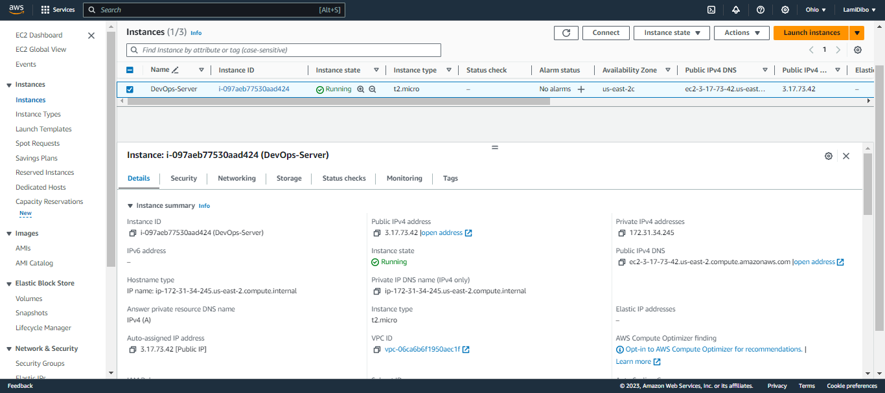

## What is LAMP Stack?
A LAMP stack is a bundle of four different software technologies that developers use to build websites and web applications. LAMP is an acronym for the operating system, Linux; the web server, Apache; the database server, MySQL; and the programming language, PHP. All four of these technologies are open source, which means they are community maintained and freely available for anyone to use. Developers use LAMP stacks to create, host, and maintain web content. It is a popular solution that powers many of the websites you commonly use today.

## Preparing Prerecuisites
#### Step 0
- Register AWS account
- Select your prefered region (region closest to you)
- Lunch EC2 instance of t2.micro family with Ubuntu Server
- Create your Key Pair, download and save in a folder. Note Key Pairs should be secured and not to share with anyone
- Lunch Windows Terminal
- Change directory to the folder that contain your Key Pair
- Connect to the AWS instance with this command `ssh -i <private-key-name>.pem ubuntu@<Public-IP-address>`

Congratulations!! You have just created your first Linux Server in the Cloud.

See Figure below:

## Step 1 - Installing Apache and Updating the Firewall
Apache is a web server software that is responsible for accepting HTTP requests from visitors and sending them back the requested information in the form of web pages.
Or in simpler terms, it allows visitors to view content on your website.

- Update a list of package manager with this command `sudo apt update`. Note if it returns an error you might need to run `sudo apt install`
- Now install apache2 package with this command `sudo apt install apache2`
- Let us verify if the apache2 is installed and running as a Service, use this command `sudo systemctl status apache2`

See Figure below:

- Let us try to check how we can access apache2 locally in our Ubuntu shell with this command `curl http://localhost:80`
- Now let us test how our Apache HTTP server can respond to request from the internet. First you need to retrieve your public ip address, this can be seen on your AWS web console or run this command in your terminal `curl -s http://169.254/latest/meta-data/public-ipv4`
- Now open your prefered web browser, and enter the code below in your address bar `http://[public_ip_address]:80`
 
 See Figure below:
 

 

 

## Step 2 Installing MySQL
Now that we have a webserver that is up and running, We need to install a Database Management System (DBMS) to store and manage data for our site in a Relational Database. 
MySQL is a popular relational database management system used within PHP environments.

Steps:
- Install MySQL with this command `sudo apt install mysql-server`
- After installing mySQl, login to the console using this command `sudo mysql`. this will connect to the MySQL server as the administrative database user *root*

It's recommended that we run a security script that comes pre-installed with MySQL. This script will remove insecure defualt settings and lock down access to our database system. Before running the script we will set a password for the root user, using mysql_native_password as default authentication method
- Let us set password for the root user using this command `ALTER USER 'root'@'localhost' IDENTIFIED WITH mysql_native_password BY 'PassWord.1';`. PassWord.1 is the set password for our root user.
- Use command `exit` to exit the shell

Start the interactive script by running `sudo mysql_secure_installation`

## Installing PHP
Now we have Apache installed to serve our content and MySQL installed to store and manage data. PHP is the final component of the LAMP technology stack. It will process code to display dynamic content to the end user. In addition to the php package, we will need `php-mysql`, a PHP module that allows PHP to communicate with MySQL-based databases. We will also need `libapache2-mod-php` to enable Apache to handle PHP files.

New step is to install all 3 packages at once with the command `sudo apt install php libapache2-mod-php php-mysql` 
Once installation is complete you can run this command `php -v` to confirm the php version.

LAMP stack setup is now complete and operational
1. Linux (Ubuntu)
2. Apache HTTP Server
3. MySQL
4. PHP

## Creating a Virtual Host for your Website using Apache
Virtual hosting is a method for hosting multiple domain names on a single server. This allows one server to share its resources, such as memory and processor cycles, without requiring all services provided to use the same host name.

In this project, you will set up a domain called `projectlamp`, but you can replace this with any domain of your choice. 
Follow the steps below:
- Create the directory for `projectlamp` with this command `sudo mkdir /var/www/projectlamp`
- Assign ownership of directory with the `$USER` environment variable, which will reference your current system user using this command `sudo chown -R $USER:$USER /var/www/projectlamp`
- Then create and open a new configuration file in apache's sites-available directory using your preferred command-line editor. Run this command `sudo vi /etc/apache2/sites-available/projectlamp.conf` 
This will create a new blank file. Paste in the below bare-bones configuration by hitting on `i` on the keyboard to switch to insert mode, then paste the text: 
`<VirtualHost *:80>
    ServerName projectlamp
    ServerAlias www.projectlamp 
    ServerAdmin webmaster@localhost
    DocumentRoot /var/www/projectlamp
    ErrorLog ${APACHE_LOG_DIR}/error.log
    CustomLog ${APACHE_LOG_DIR}/access.log combined
</VirtualHost>` 
To save and close the file, simply follow the step below:
1. Hit the `Esc` botton on the keyboard
2. Type `:`
3. Type `wq`. *w for Write and q for Quit*
4. Hit Enter on the keyboard to save the file

You can run this command `sudo ls /etc/apache2/sites-available` to show the new file in the directory

Next step is to:
- Enable the new virtual host. Run this command `sudo a2ensite projectlamp`
- Disable Apache's default website if you're not using a custom domain name. Run `sudo a2dissite 000-default`
- Confirm your configuration file does not contain syntax errors by this command `sudo apache2ctl configtest`
- Finally, is to reload Apache so these changes take effect with this command `sudo systemctl reload apache2`

The website is now active but the web root /var/www/projectlamp is still empty. Create an index.html file in that location to test that the virtual host works as expected. 
Run this command `sudo echo 'Hello LAMP from hostname' $(curl -s http://169.254.169.254/latest/meta-data/public-hostname) 'with public IP' $(curl -s http://169.254.169.254/latest/meta-data/public-ipv4) > /var/www/projectlamp/index.html`  
Now let us open our website url using IP address `http://[your-Public-IP-Address]:80` 
We can also access the website from the browser by public DNS name

You can leave this index.html file in place as a temporary landing page for your application until you set up an index.php file to replace it. Once you do that, remember to remove or rename the index.html file from your document root, as it would take precedence over an index.php file by default.

## Enable PHP on the Website
With the default Directory Index settings on Apache, a file named index.html will always take precedence over an index.php file. This is useful for setting up maintenance pages in PHP applications by creating a temporary index.html file containing an informative message to visitors. Because this page will take precedence over the index.php page, it will then become the landing page for the application. Once maintenance is over, the index.html is renamed or removed from the document root, bringing back the regular application page. 
In case you want to change this behavior, you'll need to edit the `/etc/apache2/mods-enabled/dir.conf` file and change the order in which the `index.php` file is listed within the <b>DirectoryIndex</b> directive:

Run this command `sudo vim /etc/apache2/mods-enabled/dir.conf`  
`<IfModule mod_dir.c>
        #Change this:
        #DirectoryIndex index.html index.cgi index.pl index.php index.xhtml index.htm
        #To this:
        DirectoryIndex index.php index.html index.cgi index.pl index.xhtml index.htm
</IfModule>`  
After saving and closing the file, we will need to reload Apache so the changes can take effect. Run this command `sudo systemctl reload apache2` 
inally, we will create a PHP script to test that PHP is correctly installed and configured on our server. Since we have a custom location to host our website files and folders, we will create a PHP test script to confirm that Apache is able to handle and process requests for PHP files. 
Create a new filed named index.php inside the custom web roor folder with this command `vim /var/www/projectlamp/index.php`

This will open a blank file. Add the following text, which is valid PHP code, inside the file: 
`<?php`  
`phpinfo();`  

Save and close the file. Refresh the page and you will see a PHP information landing page like this:

After checking the relevant PHP server, it is best to remove the file you created as it contains sensitive information about your PHP environment and the ubuntu server. To do that, run this command `sudo rm /var/www/projectlamp/index.php`
