## Web Stack Implementation - LEMP Stack
The project LEMP Stack covers similar concepts as that of LAMP and helps to cement the skills of deploying web solutions using LA(E)MP stacks. In this project I will be implementing a similar stack, but with an alternative Web Server-NGINX, which is also very popular and widely used by many websites on the internet.

## Step 0 - Preparing Prerequsites
1. Login into AWS account, and create an EC2 Instance with Ubuntu Server.
2. Open Git Bash terminal and connect to EC2 using ssh <br>
Syntax: `ssh -i <Your-private-key.pem> ubuntu@<EC2-Public-IP-address>`

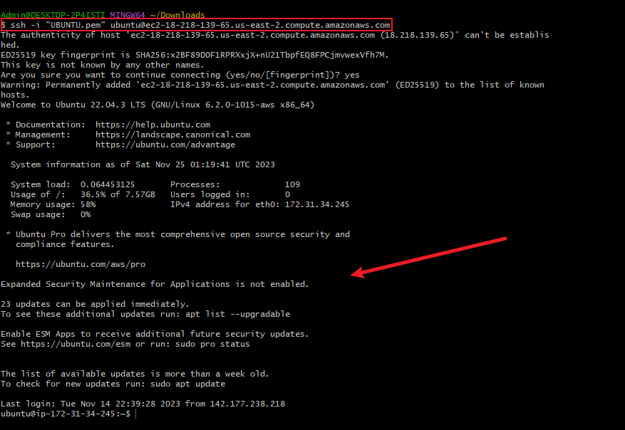

## Step 1 - Installing Nginx Web Server
In order to display web pages to site visitors, I am going to employ Nginx, a high performing web server.<br>
- Use the **apt** to first update the server's package index since this is the first time of using it in this session
-  Use **apt** package manager to install Nginx

Syntax: `sudo apt update` and `sudo apt install nginx`

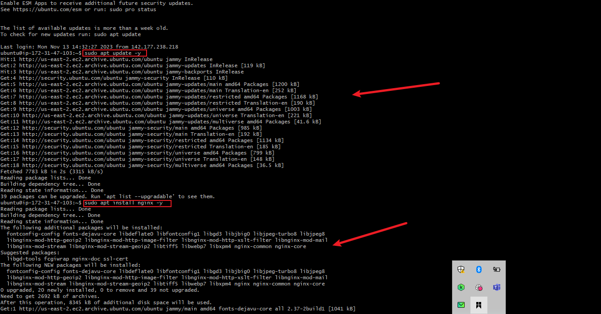

Verify that nginx was successfully installed and is running as a service in Ubuntu.<br>
Run this command `sudo systemctl status nginx`

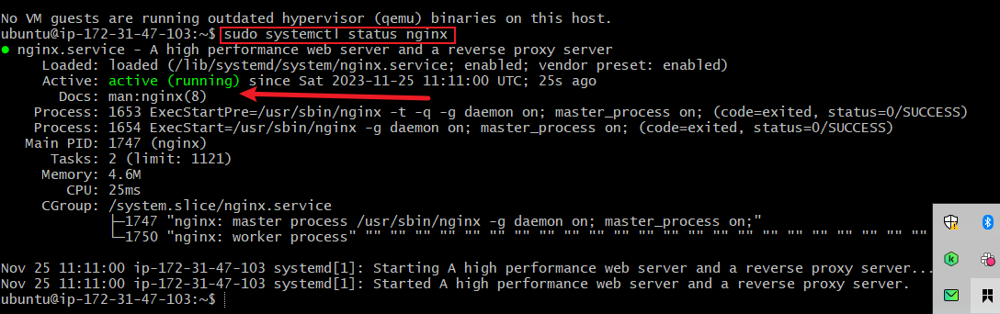

Run this syntax: `curl http://localhost:80` to verify if port 80 is opened.

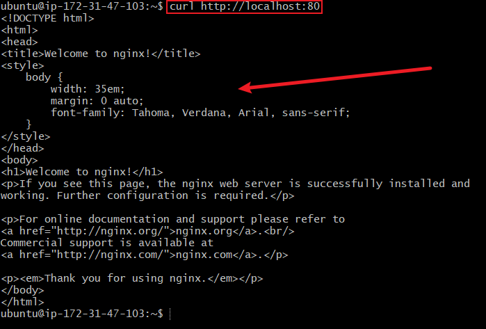

Run this syntax `http://<public-ip-address>:80` into a web browser to test that our Nginx server can respond to requests from the internet.

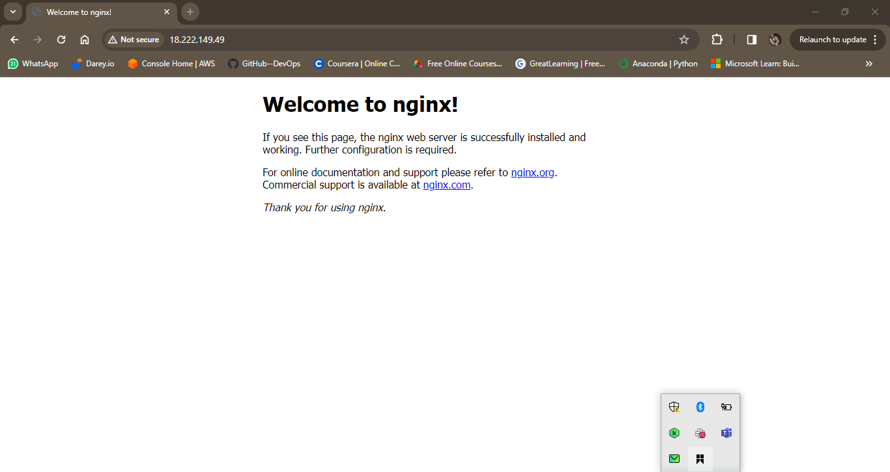

## Step 2 - Installing MySQL
Now that a webserver is up and running, we need to install a Database Management System (DBMS) to store and manage data for our site in a Relational Database. MySQL is a popular relational database management system used within PHP environments.<br>
Run this command `sudo apt install mysql-server -y` to install MySQL server.<br>
Also run `sudo mysql` to login into mysql console.

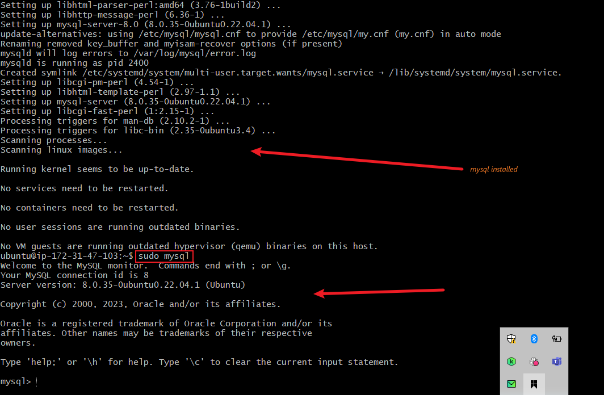

Run this command `ALTER USER 'root'@'localhost' IDENTIFIED WITH mysql_native_password BY 'PassWord.1';` to set password for **root** user. Then type *Exit* to leave mysql console.

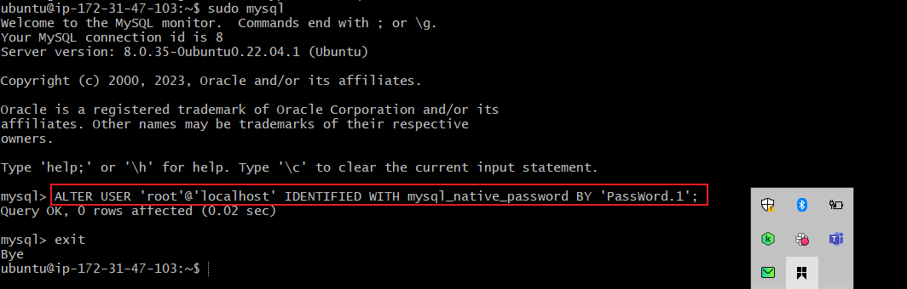

Run this command `sudo mysql_secure_installation` to begin interactive script.

Test login to mysql console after completing the interactive installation script with this command `sudo mysql -p`

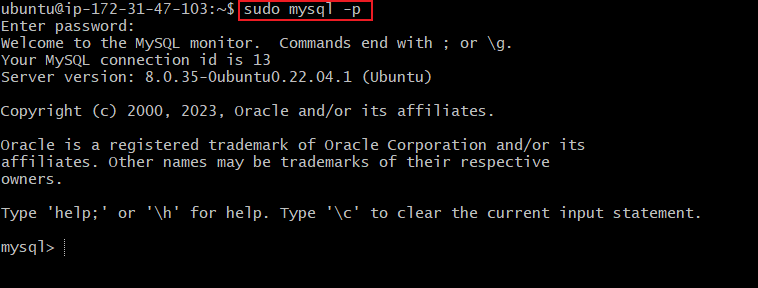

MySQL server is now installed and secured.

## Step 3 - Installing PHP
Now we have Nginx installed to serve our content and MySQL installed to store and manage our data. We can now install PHP, this will process code and generate dynamic content to the end user.<br>
While Apache embeds the PHP interpreter in each request, Nginx requires an external program to handle PHP processing and act as a bridge between the PHP interpreter itself and the web server. This allows for a better overall performance in most PHP-based websites but it requires additional configuration.<br>
We need to install php-fpm which stands for PHP fast CGI process manager and tell Nginx to pass PHP requests to this software for processing. In addition, we need php-mysql, a PHP module that allows PHP to communicate with MySQL-based databases.

To achieve all this, we need to run the following command: `sudo apt install php-fpm php-mysql` this will install the 3 packages at once.<br>
Once installation is complete you can run this command `php -v` to confirm the php version installed.

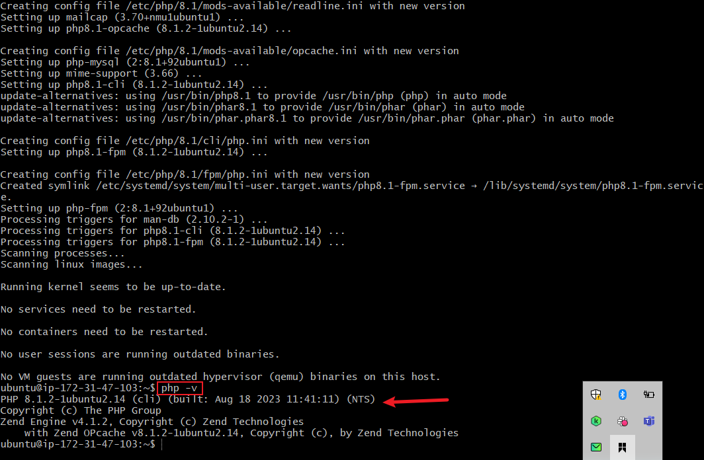

## Step 4 - Configuring Nginx to use PHP Processor
When using Nginx web server, we can create server blocks (similar to virtual hosts in Apache) to encapsulate configuration details and host more than one domain on a single server. In this project, we will use **projectLEMP** as an example domain name.

On Ubuntu 20.04, Nginx has one server block enabled by default and is configured to serve documents out of the directory at `/var/www/html`. While this works well for a single site, it can become difficult to manage if you are hosting multiple sites. So instead of modifying `/var/www/html`, we'll create a directory structure within `/var/www` for our domain website.<br>
To create root web directory for our domain, follow the below steps:
- Create a root web directory for our domain: `sudo mkdir /var/www/projectLEMP`.
- Assign ownership of the directory with the $USER environment variable, which will reference your current system user `sudo chown -R $USER:$USER /var/www/projectLEMP`.
- Open a new configuration file in Nginx's sites-available directory using your preferred command-line editor. We will be using nano this time. `sudo nano /etc/nginx/sites-available/projectLEMP`. This will create a blank file where we will paste the below bare-bones configuration.
```
#/etc/nginx/sites-available/projectLEMP

server {
    listen 80;
    server_name projectLEMP www.projectLEMP;
    root /var/www/projectLEMP;

    index index.html index.htm index.php;

    location / {
        try_files $uri $uri/ =404;
    }

    location ~ \.php$ {
        include snippets/fastcgi-php.conf;
        fastcgi_pass unix:/var/run/php/php8.1-fpm.sock;
     }

    location ~ /\.ht {
        deny all;
    }

}
```
Below details what each of these directives and location blocks do:<br>
1. `listen` - Defines what port Nginx will listen on. In this case port 80, the default HTTP port.
2. `root` - Defines the document root where the files served by this website are stored.
3. `index` - Defines in which order Nginx will prioritize index files for this website. It is common practice to list index.html files with a higher precedence than index.php files to allow for quickly setting up a maintenance landing page in PHP applications. You can adjust these settings to better suit your application needs.
4. `server-name` - Defines which domain names and/or IP addresses this server block should respond for. Point this directive to your server's domain name or public IP address.
5. `location /` - The first location block includes a try_files directive, which checks for the existence of files or directories matching a URI request. If Nginx cannot find the appropriate resource, it will return a 404 error.
6. `location ~ \.php$` - This location block handles the actual PHP processing by pointing Nginx to the fastcgi-php.conf configuration file and the php7.4-fpm.sock file, which declares what socket is associated with php-fpm
7. `location ~ /\.ht` - The last location block deals with .htaccess files, which Nginx does not process. By adding the deny all directive, if any .htaccess files happen to find their way into the document root, they will not be served to visitors.

- After editing, save and close the file. For nano, you can do so by typing CTRL+X, then y, and then ENTER to confirm.
- Activate your configuration by linking to the config file from Nginx's sites-enabled directory. sudo ln -s /etc/nginx/sites-available/projectLEMP /etc/nginx/sites-enabled/. This will tell Nginx to use the configuration next time it is reloaded.
- You can test your config for syntax errors by typing: sudo nginx -t. You shall see the following message:<br>
`nginx: the configuration file /etc/nginx/nginx.conf syntax is ok`<br>
`nginx: configuration file /etc/nginx/nginx.conf test is successful` <br>
- Disable default Nginx host that is currently configured to listen on port 80 run `sudo unlink /etc/nginx/sites-enabled/default`
- Reload Nginx server to apply all the changes: `sudo systemctl reload nginx`.<br>
Our new website is now active, but the web root `/var/www/projectLEMP` is still empty. Create an index.html file in that location so that we can test our new server block as expected.<br>
Run this command `sudo echo 'Hello LEMP from hostname' $(curl -s http://169.254.169.254/latest/meta-data/public-hostname) 'with public IP' $(curl -s http://169.254.169.254/latest/meta-data/public-ipv4) > /var/www/projectLEMP/index.html`.<br>
Now go to your browser and try to open your website URL using your IP address or DNS-name.

You can leave this `index.html` file in place as a temporary landing page for your application until you setup an `index.php` file to replace it. Once you do that, remember to remove or rename the index.html file from your document root, as it would take precedence over an `index.php` file by default.<br>
LEMP stack is now fully configured. In the next step, we will create a PHP script to test that Nginx is in fact able to handle `.php` files within the newly configured website.

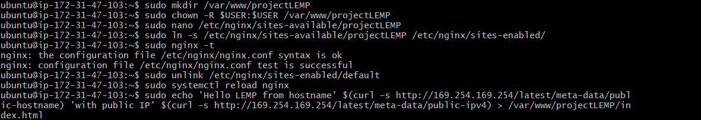

## Step 5 - Testing PHP with Nginx
- Create a test PHP file called `info.php` in the document root with this command `nano /var/www/projectLEMP/info.php`
- Paste the PHP lines below into the new file. This is valid PHP code that will return information about the server.<br>
```
<?php
phpinfo();
```
Let's now access this page in the web browser by visiting the domain name or public IP address set up in Nginx configuration file, followed by `/info.php` <br> Syntax: `http://server_domain_or_IP/info.php`

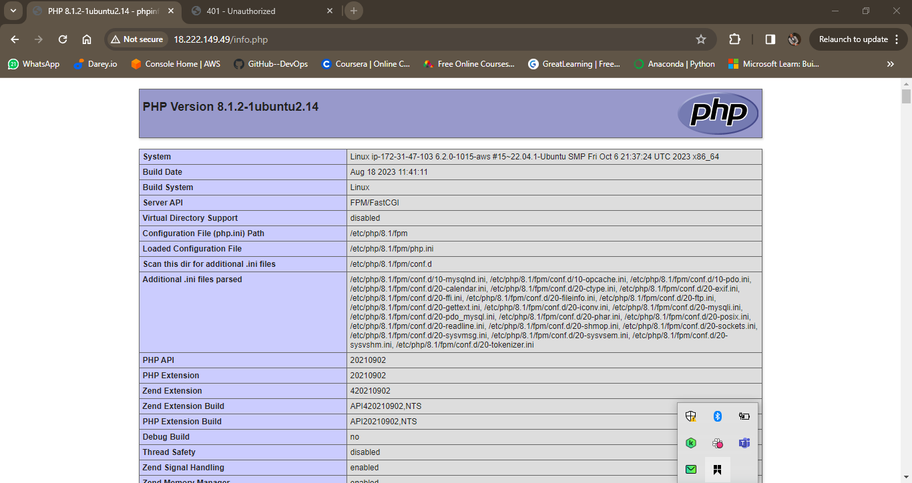

After checking the relevant PHP information, it is best to remove the file created as it contains sensitive system information by running this command `sudo rm /var/www/projectLEMP/info.php`

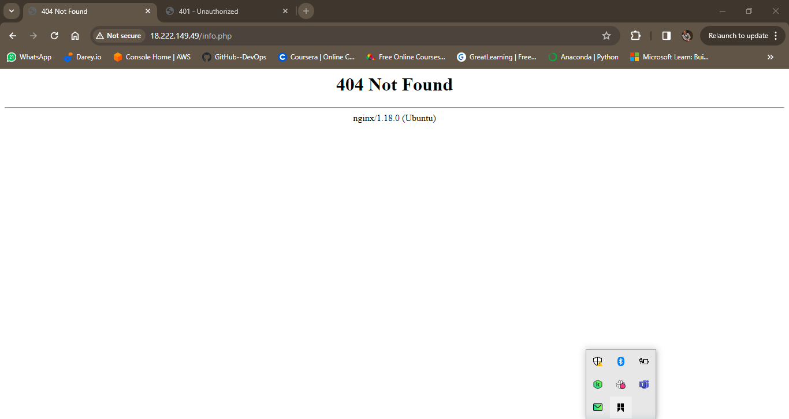

## Step 6 - Retrieving data from MySQL database with PHP
In this step we will be creating a test database (DB) with simple "To-do list" and configure access to it, so the Nginx website can query data from the DB and display it.<br>
 We will create a database named *sample_database* and a user named *sample_user* and grant the new user full privileges to the newly created database.

- Connect to the MySQL console using root account with this command `sudo mysql -p`
- Create the new database `mysql>  CREATE DATABASE sample_database;`
- Create the new user `mysql>  CREATE USER sample_user@localhost IDENTIFIED WITH mysql_native_password BY 'PassWord.1';`
The above command creates the new user using mysql_native_password as default authentication method.
- Give *sample_user* full privileges to the new database `mysql> GRANT ALL ON sample_database.* TO sample_user@localhost;`
- Exit the MySQL shell.

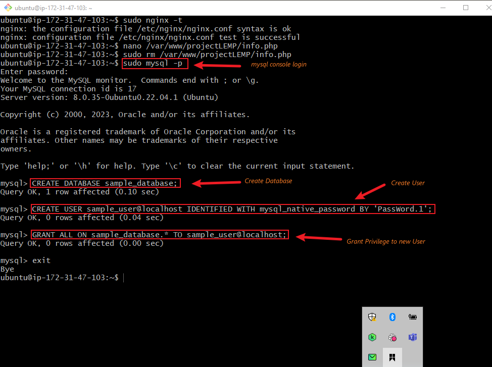

We can now test if the new user has the proper permissions by logging into the MySQL console again, this time using the custom user credentials:
`mysql -u sample_user -p` and also confirm we have access to the database using this sytanx `mysql> SHOW DATABASES;`

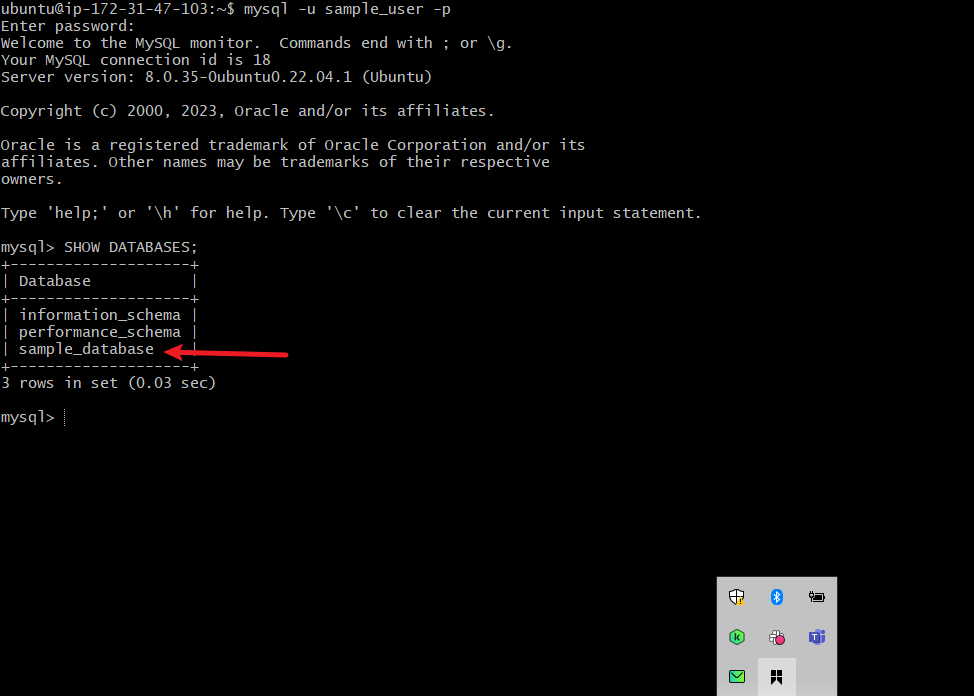

- We will create a test table named *todo_list*. From MySQL console, run the following command:
`CREATE TABLE sample_database.todo_list (item_id INT AUTO_INCREMENT,content VARCHAR(255),PRIMARY KEY(item_id));`
- Next, insert a few rows of content in the test table. You might want to repeat the next command a few times, using different VALUES `mysql> INSERT INTO example_database.todo_list (content) VALUES ("My first important item");`

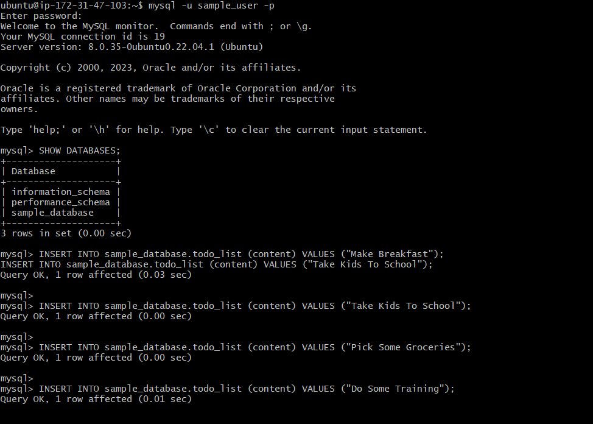
- To confirm that the data was successfully saved to our table, run:`mysql>  SELECT * FROM example_database.todo_list;`

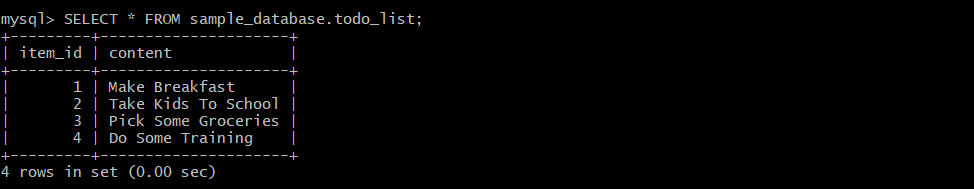
- Exit the MySQL console

- Now we can creatte a PHP script that will connect to MySQL and query for our content.<br>
Create a new PHP file in the custom web root directory using any preferred editor. Let's use *vi editor* with this command `nano /var/www/projectLEMP/todo_list.php`
- Paste the below PHP code into the `todo_list.php`
```
<?php
$user = "example_user";
$password = "PassWord.1";
$database = "example_database";
$table = "todo_list";

try {
  $db = new PDO("mysql:host=localhost;dbname=$database", $user, $password);
  echo "<h2>TODO</h2><ol>";
  foreach($db->query("SELECT content FROM $table") as $row) {
    echo "<li>" . $row['content'] . "</li>";
  }
  echo "</ol>";
} catch (PDOException $e) {
    print "Error!: " . $e->getMessage() . "<br/>";
    die();
}
```
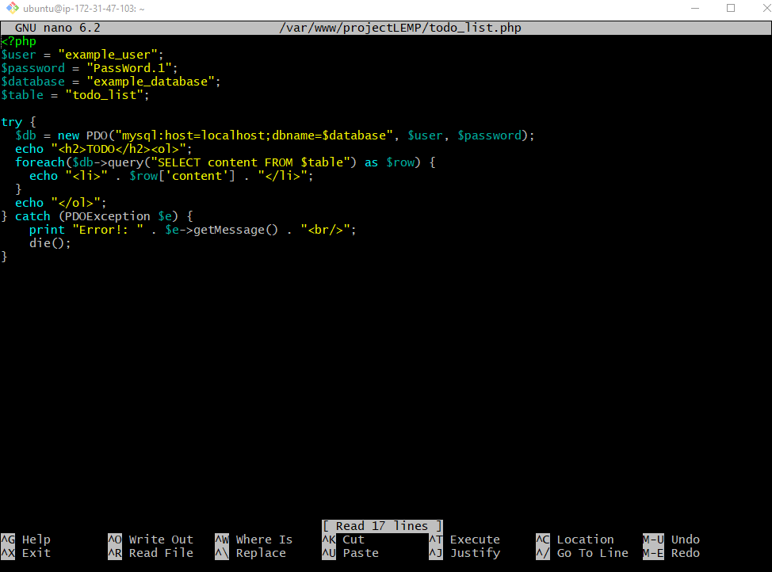

Save and close the file when you are done editing

We can now access this page in web browser by visiting the domain name or public IP address configured for the website, followed by `/todo_list.php`
